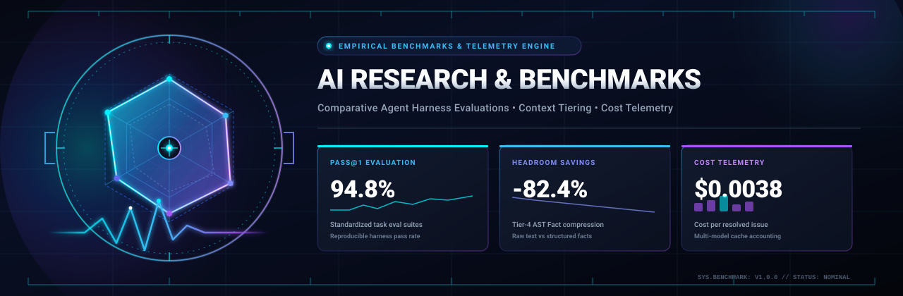
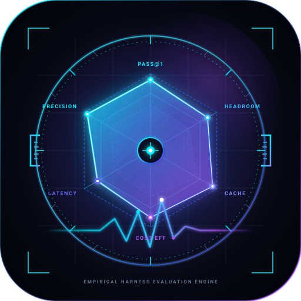
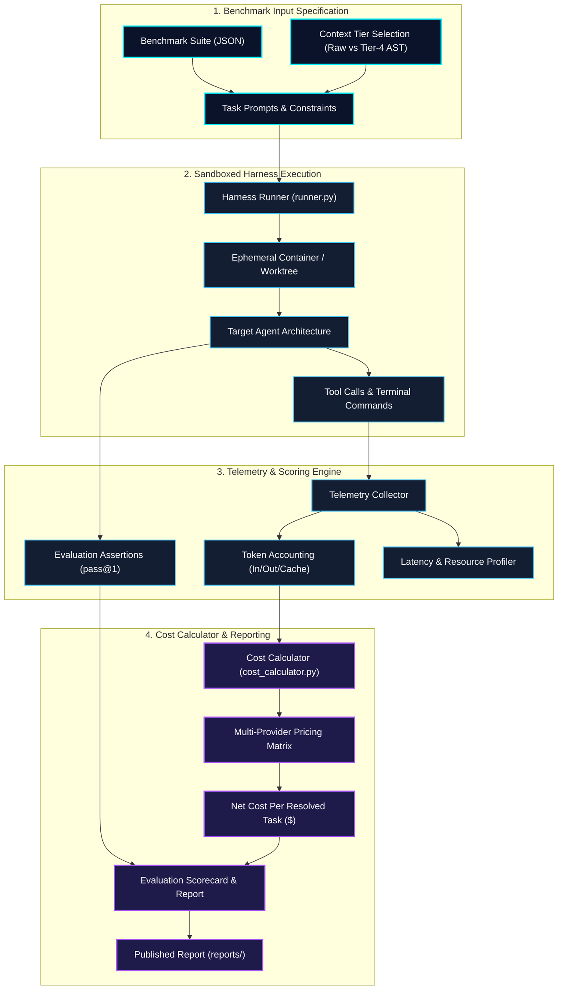

<div align="center">



<br/><br/>



# Koality-Assured AI Research &amp; Benchmarks

**Empirical Agent Harness Evaluations • Multi-Tier Context Benchmarks • Token Cost &amp; Telemetry Engine**

[](https://github.com/Koality-Assured/ai-research-and-benchmarks/actions/workflows/ci.yml)
[](LICENSE)
[](pyproject.toml)
[](benchmarks/)
[](reports/)
[](https://conventionalcommits.org)

<br/>

</div>

`ai-research-and-benchmarks` is the empirical evaluation laboratory and open research repository of Koality-Assured. We design reproducible benchmark suites, publish comparative harness evaluations, measure context retrieval trade-offs, and engineer real-time token cost telemetry across autonomous coding frameworks and LLM reasoning models.

---

## Mission Statement

Modern AI coding agents demand rigorous, repeatable, and cost-aware benchmarking. Our mission is to replace marketing claims with open scientific measurement:

1. **Empirical Benchmarks:** Measure objective task completion (`pass@1`), wall-clock latency, and tool-call precision across diverse agent harness architectures.
2. **Comparative Framework Evaluations:** Conduct reproducible head-to-head evaluations of leading multi-agent runtimes (LangGraph, AutoGen, CrewAI, and native decoupled harnesses).
3. **Context Tiering & Headroom Optimization:** Quantify the trade-offs between raw verbatim context ingestion and compressed Tier-4 AST Fact extraction using Headroom compression.
4. **Precision Telemetry & Cost Accounting:** Provide vendor-accurate token accounting that captures blended input, output, and KV prompt cache read/write rates down to micro-dollar granularity.

---

## Architecture Overview

```
ai-research-and-benchmarks/
├── .github/workflows/ci.yml            # Automated CI pipeline & dry-run validation
├── assets/                             # Vector brand identity & telemetry graphics
│   ├── ai-research-and-benchmarks-banner.svg   # High-precision vector hero banner
│   └── ai-research-and-benchmarks-logo.svg     # Caliper & radar chart vector logo
├── benchmarks/                         # Standardized test suites & specifications
│   ├── README.md                       # Benchmark catalog & format guide
│   ├── suites/
│   │   └── coding_agent_benchmark_v1.json  # Reference autonomous coding suite
│   └── supporting/
│       ├── AGENTS.md                   # Operational constraints for benchmark tasks
│       └── methodology.md              # Empirical scoring protocols & guidelines
├── harnesses/                          # Execution runners & harness adapters
│   ├── README.md                       # Harness adapter documentation
│   ├── runner.py                       # Core benchmark execution harness runner
│   └── benchmarks/                     # Domain benchmark modules
│       ├── benchmark_agent_fleet.py    # Multi-agent fleet scalability benchmarks
│       ├── benchmark_retrieval.py      # BM25 vs AST symbol retrieval evaluation
│       ├── benchmark_task_eval.py      # Standardized task execution & pass@1 scoring
│       ├── benchmark_tool_efficiency.py# Output compression & serialization profiling
│       ├── estimate_agent_costs.py     # Agent & skill token consumption modeling
│       └── run_benchmark_suite.py      # Consolidated multi-suite test runner
├── telemetry/                          # Token usage & cost calculation engine
│   ├── README.md                       # Telemetry protocols & calculation methodology
│   └── cost_calculator.py              # Multi-vendor token pricing & headroom engine
├── reports/                            # Published research papers & scorecards
│   ├── README.md                       # Report index & publishing criteria
│   └── template_evaluation_report.md   # Standard evaluation report template
├── research/                           # Deep-dive research archives & whitepapers
│   ├── agent-harnesses/                # Architecture comparisons & red-team logs
│   ├── ast-grep/                       # AST-guided symbol extraction studies
│   ├── headroom/                       # Context headroom compression benchmarks
│   └── secpanic-idler/                 # Safety & idle prevention evaluations
├── tests/                              # Automated test suite
│   └── test_benchmarks.py              # Verification for runners, suites, and cost models
├── pyproject.toml                      # Python build system & package definitions
├── LICENSE                             # MIT License
└── README.md                           # Repository documentation & guide
```

---

## Benchmark Suites

The repository hosts four primary empirical evaluation suites designed to measure each layer of the agent execution lifecycle:

| Suite | Implementation | Core Metrics | Focus Area |
| :--- | :--- | :--- | :--- |
| **`task-eval`** | [`harnesses/benchmarks/benchmark_task_eval.py`](harnesses/benchmarks/benchmark_task_eval.py) | `pass@1`, task duration, artifact completeness | Evaluates autonomous coding agent task execution quality, bug resolution fidelity, and unit test generation. |
| **`cost-estimator`** | [`telemetry/cost_calculator.py`](telemetry/cost_calculator.py) <br/> [`harnesses/benchmarks/estimate_agent_costs.py`](harnesses/benchmarks/estimate_agent_costs.py) | Input/output tokens, KV cache hit savings, cost/task ($) | Models token consumption, multi-tier pricing, and monetary expense per resolved issue across LLM model families. |
| **`tool-efficiency`** | [`harnesses/benchmarks/benchmark_tool_efficiency.py`](harnesses/benchmarks/benchmark_tool_efficiency.py) | Compression ratio (%), serialization overhead, fact retention | Benchmarks tool output compression, AST extraction fidelity, and Headroom token reductions on bulky command outputs. |
| **`retrieval-benchmark`**| [`harnesses/benchmarks/benchmark_retrieval.py`](harnesses/benchmarks/benchmark_retrieval.py) | MRR (Mean Reciprocal Rank), Precision@K, search latency | Quantifies accuracy, relevance, and token savings of dual-retrieval indexes (BM25 lexical vs AST symbol graph). |

---

## Telemetry & Cost Engine

The telemetry engine models real-world API economics across major cloud LLM providers, factoring in prompt cache write/read differentials that standard token counters ignore:



### Supported Pricing Models

The cost engine dynamically models rates per million tokens across foundational provider families:

- **Google DeepMind:** Gemini 3.7 Flash, Gemini 1.5 Flash, Gemini 1.5 Pro, Gemini 3.1 Pro
- **Anthropic:** Claude 3.5 Haiku, Claude 3.5 Sonnet, Claude 3.7 Sonnet (Standard & Extended Thinking)
- **OpenAI:** GPT-4o, GPT-4o mini, o1, o3-mini

---

## Quickstart & Execution

### Prerequisites

- Python >= 3.10
- Git 2.38+

### Setup

```bash
# Clone the repository
git clone https://github.com/Koality-Assured/ai-research-and-benchmarks.git
cd ai-research-and-benchmarks

# Install dependencies
pip install -e .
pip install -e ".[dev]"
```

### Running Benchmark Suites

#### 1. Task Evaluation Dry-Run

Validate benchmark task definitions without consuming external API credits:

```bash
python harnesses/runner.py --suite benchmarks/suites/coding_agent_benchmark_v1.json --dry-run
```

#### 2. Cost & Headroom Analysis

Calculate the exact monetary delta between raw context dumps (50,000 tokens) and Headroom-compressed context (8,000 tokens):

```bash
# Calculate single run cost
python telemetry/cost_calculator.py --input-tokens 50000 --output-tokens 2000 --model gpt-4o

# Compare headroom compression savings
python telemetry/cost_calculator.py --input-tokens 8000 --output-tokens 2000 --compare-raw 50000 --model gpt-4o
```

#### 3. Tool Output Compression Profiling

Measure AST fact extraction and Headroom serialization savings on verbose command outputs:

```bash
python harnesses/benchmarks/benchmark_tool_efficiency.py --dry-run
```

#### 4. Retrieval Benchmark Evaluation

Measure corpus search precision, recall, and token reduction across repository queries:

```bash
python harnesses/benchmarks/benchmark_retrieval.py --dry-run
```

---

## Running Tests

Run the unit test suite locally using `pytest` or Python's standard `unittest`:

```bash
# Using pytest
pytest -v

# Using standard unittest
python -m unittest discover -s tests -v
```

---

## Research Ethics & Empirical Methodology

Every published benchmark adhering to Koality-Assured standards follows these requirements:

- **Deterministic Seeds:** All evaluations lock temperature, sampling top-p, and execution seeds across tested models.
- **Uniform Quotas:** Identical timeout boundaries, tool availability, and memory constraints are enforced across competing harnesses.
- **Transparent Attribution:** Token costs include full attribution of input, output, cache-write, and cache-read rates rather than simplified headline figures.
- **Zero Cherry-Picking:** All task failure traces, timeout exceptions, and anomalous outputs are published alongside aggregate pass rates.

---

## Security Notice

Benchmark harnesses execute dynamically generated code within evaluation loops. Harness runners **MUST** be deployed inside sandboxed containers, ephemeral virtual machines, or isolated worktrees with network isolation enabled.

To report security vulnerabilities or misconfigurations, contact **security@koality-assured.org**.

---

## Contributing

We welcome benchmark task submissions, harness adapters, and peer-reviewed evaluation reports:

1. Review the task guidelines in [`benchmarks/supporting/methodology.md`](benchmarks/supporting/methodology.md).
2. Format new benchmark task suites following [`benchmarks/suites/coding_agent_benchmark_v1.json`](benchmarks/suites/coding_agent_benchmark_v1.json).
3. Draft comparative findings using [`reports/template_evaluation_report.md`](reports/template_evaluation_report.md).
4. Submit a Pull Request following Conventional Commits (`feat:`, `fix:`, `docs:`).

---

## License

Distributed under the [MIT License](LICENSE). Copyright &copy; 2026 Koality-Assured.
