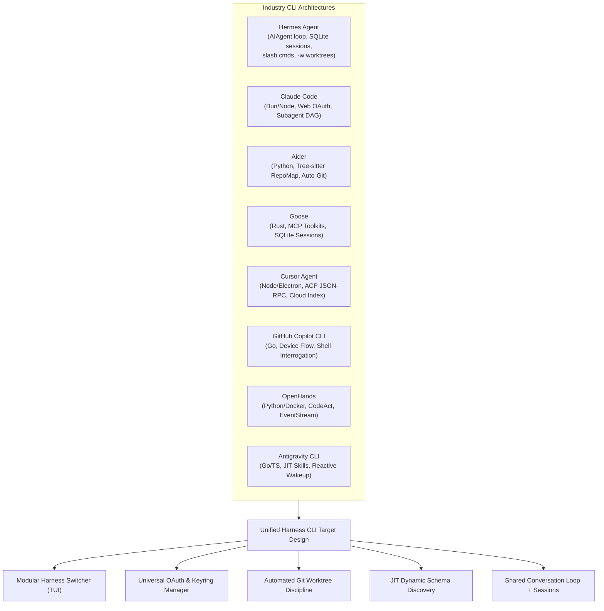
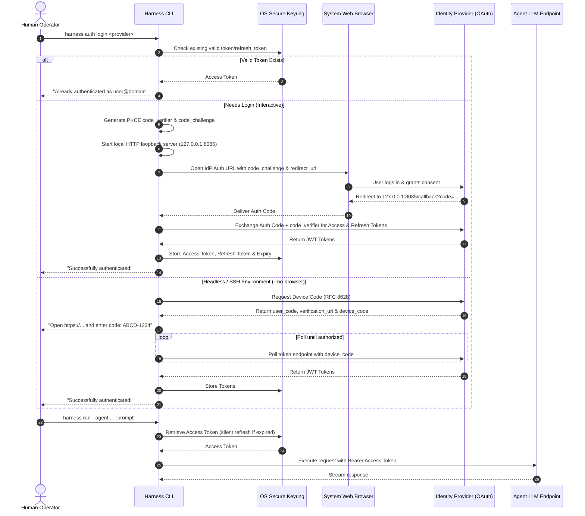
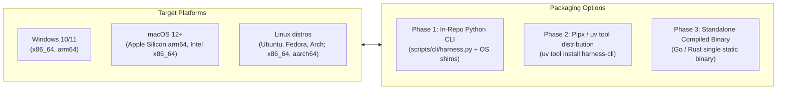
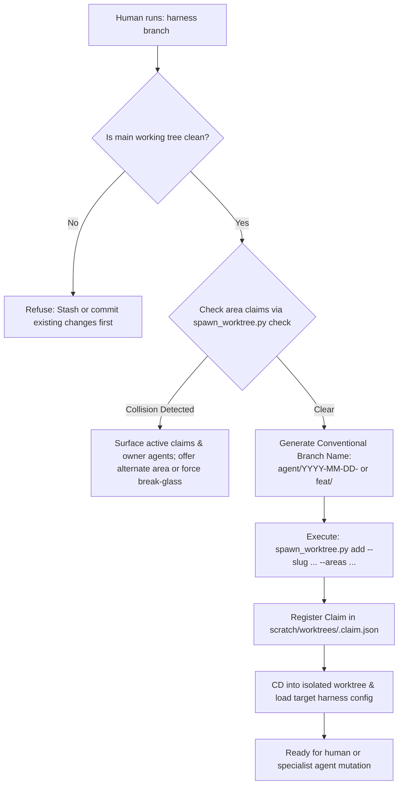

# Comparative Architecture of CLI-Based AI Agent Harnesses & Worktree Methodology

Investigation into modern command-line agent harnesses (Hermes Agent, Claude Code, Aider, Goose, Cursor Agent, GitHub Copilot CLI, OpenHands, and Antigravity CLI), universal OAuth/Keyring authentication across major foundation model providers, cross-platform execution dynamics, and automated git worktree discipline.

---

## 1. Executive Summary & Problem Framing

Modern software engineering with autonomous AI agents has exposed a sharp operational divide:
1. **IDE-Centric Interfaces** (Cursor, Copilot, Windsurf): Provide visual diffs and editor awareness but struggle with headless automation, strict branch isolation, scriptable CI/CD pipelines, and multi-repository or multi-harness switching.
2. **Ad-Hoc Terminal Scripts**: Provide command-line accessibility but often lack robust authentication lifecycle management, interactive context switching, branch and worktree discipline, and cross-platform reliability across Windows, Linux, and macOS.
3. **Control plane vs conversation loop**: A multi-repo harness CLI can own registry, worktrees, claims, and auth without owning the agent turn loop. Designs that treat the CLI as the harness put one conversation engine behind every surface (terminal, messaging, IDE protocol, batch, API).

To enable humans and autonomous agents to collaborate seamlessly across our ecosystem of domain-specific routers (`ai-router`, `art-router`, `legal-router`, `ui-ux-router`, `financial-advisement-router`, and `game-dev-router`), we require a **unified, cross-platform CLI methodology**. Today this repo’s harness CLI is primarily a **control plane**: harness registry and switcher, worktree + area claims, auth vault, and PR helper. The closer industry match for the newer goal — **the CLI is the harness** (conversation loop, sessions, auth, skills, worktrees) — is **Hermes Agent** ([Nous Research](https://hermes-agent.nousresearch.com/)): one `AIAgent` loop shared by CLI, TUI, messaging gateway, ACP, batch, and API, with SQLite resume, a shared slash-command registry, self-registering tools/toolsets, provider resolution, `hermes -w` worktrees with content-gated prune, and skills as slash commands.

The control-plane layer still must:
- Simplify harness discovery and interactive switching across domain routers.
- Enforce git worktree isolation and area-based claim locks before any file mutations occur.
- Unify authentication across diverse model providers (Anthropic Claude, OpenAI GPT, Google Gemini, Cursor) via OAuth 2.0 PKCE, Device Authorization flows, and OS-native secure credential vaults.
- Provide a modular distribution path from local in-repo Python automation to an upstream generic core (`ai-harness-core`) and a standalone compiled multi-arch binary.

---

## 2. Comparative Analysis of Existing Direct CLI Harnesses

We evaluated eight prominent CLI-native agent architectures to identify key strengths, design patterns, and failure modes. Hermes Agent is the closest match when the product goal is “CLI is the harness” rather than “CLI switches other harnesses.”



### Detailed Evaluation Matrix

| Architectural Dimension | Hermes Agent (`hermes`) | Claude Code (`claude`) | Aider (`aider`) | Goose (Block) | Cursor Agent (`cursor-agent`) | GitHub Copilot CLI (`gh copilot`) | OpenHands | Antigravity CLI (`agy`) |
| :--- | :--- | :--- | :--- | :--- | :--- | :--- | :--- | :--- |
| **Language & Runtime** | Python; `AIAgent` facade + `agent/` turn loop | Node.js / Bun | Python (`prompt_toolkit`, `rich`) | Rust (native binary) | Node.js / Electron headless | Go (compiled binary) | Python + Docker daemon | Go / TypeScript core |
| **Primary Interaction** | CLI + TUI + messaging gateway + ACP + batch + API; one conversation loop | Interactive TUI + streaming diffs; print mode (`-p`) | Interactive REPL; in-terminal diffs; `--message` headless | Terminal TUI + Desktop GUI | Terminal chat + ACP JSON-RPC server | Command interrogation & explanation | Web UI + headless terminal loop | Rich TUI, slash commands, headless tasks |
| **Authentication Flow** | Shared provider resolver (`PROVIDER_REGISTRY` / runtime provider); OAuth + credential pools; `hermes setup --portal` | Web OAuth 2.0 PKCE (`claude login`); `--no-browser` manual code; API keys | Environment API keys (`OPENAI_API_KEY`, etc.); OpenRouter | API keys in keyring or env; Databricks OAuth | Browser SSO (`agent login`); `CURSOR_API_KEY`; ACP handshake | GitHub OAuth Device Code Flow (`gh auth login`) | Environment API keys mounted in container | Google Account OAuth / Vertex IAM / API key |
| **Credential Storage** | Profile-scoped `HERMES_HOME` + provider credential resolution | `~/.claude.json` / OS credential store | Plaintext `.env` / shell environment variables | Native OS Keyring (`keyring-rs`) | VS Code state SQLite / OS Keychain | OS Credential Manager (`gh` vault) | Container environment / `.env` | Local app data credential cache |
| **Git / Branch Integration** | `hermes -w` disposable worktrees under `.worktrees/`; content-gated `hermes worktree prune` | Inspects repo root; checks uncommitted status; creates PRs | Automatic atomic git commits with Conventional messages | Basic file status checks; confirmation prompts | Workspace tracking; dirty file awareness | Shell command generation (`git ...`) | Clones into isolated Docker container | Worktree branching (`inherit`, `branch`, `share`) |
| **Subagent / Specialist Model** | Tool registry + toolsets; `delegate_task` subagents; skills as slash commands | Hierarchical subagents with typed built-in tools | Architect + Editor duality (reasoner produces plan, editor diffs) | Single-agent loop with pluggable MCP toolkits | Monolithic agent with background indexing | Single-turn command translation | EventStream (CodeActAgent, BrowsingAgent) | Reactive multi-agent hierarchy (`invoke_subagent`) |
| **Cost & Token Layers** | Status bar tokens/cost; compression; Anthropic prompt caching | Real-time token/dollar counter; prompt cache flags | Adaptive Tree-sitter elided RepoMap budget (1-2k tokens) | Session SQLite logs; token stats | Cloud indexing; token usage hidden | Token usage managed by GitHub | Full trajectory event logs in JSON | Reactive tokens, compression layers |

### Hermes Agent: closest CLI-is-the-harness match

Official product: [Hermes Agent](https://hermes-agent.nousresearch.com/) (Nous Research). Distinct from the **Nous Hermes model family** (prompt-native tool tokens) covered in [`industry-frameworks.md`](./industry-frameworks.md).

| Surface | What Hermes does |
| :--- | :--- |
| **One conversation loop** | Platform-agnostic `AIAgent` (`run_agent.py` facade; loop in `agent/conversation_loop.py` + `agent/turn_*.py`) serves CLI, gateway, ACP, batch, and API. Entry points differ; the agent does not. |
| **Sessions** | SQLite persistence (`hermes_state.py`; CLI store under `~/.hermes/state.db`) with FTS5, lineage across compressions, resume via `hermes --continue` / `--resume` / `/resume`. |
| **Slash commands** | Central `COMMAND_REGISTRY` in `hermes_cli/commands.py` drives interactive CLI and messaging gateway surfaces. |
| **Tools** | Self-registering `tools/registry.py` at import time; toolsets via `toolsets.py`; discovery through `model_tools.py`. |
| **Provider / auth** | Shared runtime resolver maps `(provider, model)` → `(api_mode, api_key, base_url)` for CLI, gateway, cron, ACP, and auxiliary calls. |
| **Worktrees** | `hermes -w` creates isolated worktrees; `hermes worktree list` / `prune` reclaim safely. Branch deletion is **content-gated** (reachable or patch-equivalent to trunk/upstream; never unique unpushed work). |
| **Skills** | Installed skills under `~/.hermes/skills/` register as slash commands; `-s` / `skills.auto_load` preload into the session prompt. |

**Our harness CLI today (control plane):** multi-harness registry/switcher, `spawn_worktree.py` area claims, OAuth/keyring vault, validators + `harness pr` helper — orchestration around domain routers, not the turn loop itself.

**Early stubs toward CLI-as-harness (this worktree):** `scripts/cli/session_store.py`, `scripts/cli/conversation.py`, and `scripts/cli/command_registry.py` exist as the start of a session store, single-turn chat, and slash-command registry. They are not a Hermes-parity runtime.

**Gap vs Hermes (still missing as first-class CLI runtime):**
1. Shared multi-surface conversation loop (CLI / TUI / messaging / ACP / batch / API).
2. Hermes-grade session continuity: FTS and compression lineage across resumed sessions. Basic SQLite create/resume lives in `scripts/cli/session_store.py`; it does not yet compress or full-text index.
3. Full tool loop (self-registering registry + toolsets bound into every turn).
4. Streaming token/tool progress in the terminal.
5. Messaging gateway and ACP entry points on the same agent core.
6. Skills as slash commands / prompt-preloaded procedures on that loop.
7. Interactive `hermes -w`-style worktree flag + content-gated prune co-located with the agent session (we already isolate via `spawn_worktree.py`; Hermes couples isolation to the running agent CLI).

### Key Architectural Lessons

1. **Dual Execution Modes (TUI vs. Headless)**:
   - Claude Code and Aider succeed because they serve two distinct needs: an interactive, human-facing conversational interface with rich syntax highlighting and diff inspection, and a headless, non-interactive pipeline flag (`-p` / `--message`) suitable for shell scripts, CI runners, and agent orchestration.
   - Hermes adds a third pattern: one interruptible conversation loop with callbacks, reused by CLI, TUI, gateway, ACP, batch, and API.
   - *Design Takeaway*: The harness CLI must support interactive selection (`harness`), direct deterministic control-plane commands (`harness branch <slug> --areas ...`), and — if pursuing CLI-as-harness — a single conversation engine those surfaces share.

2. **Automated Version Control Discipline**:
   - Aider's greatest strength is its atomic git integration: every modification is tested and committed with a clean Conventional Commit message.
   - Conversely, Claude Code and Cursor often modify dirty working copies in-place, risking uncommitted human changes or inter-agent merge conflicts.
   - Hermes `hermes -w` plus content-gated prune shows how disposable agent worktrees can reclaim disk without deleting unique commits or dirty trees.
   - *Design Takeaway*: The harness CLI must never mutate files directly on the primary working tree. It must enforce **worktree isolation** via `spawn_worktree.py` before any specialist agent or human mutation begins; prune/teardown should be content-gated like Hermes, not name-gated.

3. **Pluggable Protocol Layer (MCP & Schemas)**:
   - Goose and Claude Code leverage extensible protocols (Model Context Protocol / typed tool schemas) so new capabilities can be registered without modifying the CLI binary itself.
   - Hermes self-registers tools at import time into a central registry and groups them into toolsets; skills become slash commands without growing the core tool schema.
   - *Design Takeaway*: The CLI must dynamically ingest `harness.config.json`, `routing/areas.yaml`, and `routing/skill-dispatch.md` at runtime; a conversation-loop evolution should prefer registry/toolset/skill edges over a widening core tool surface.

4. **Session continuity as harness substrate**:
   - Hermes treats SQLite sessions + resume as part of the product waist, not an afterthought of the TUI.
   - *Design Takeaway*: Moving from control plane to CLI-as-harness requires durable session identity, resume, and shared slash-command dispatch before messaging or ACP entry points are worthwhile.

---

## 3. Universal Authentication & Credential Architecture

A primary requirement is enabling humans and automated workflows to authenticate seamlessly across whichever foundation agent or model provider they select (Anthropic Claude, OpenAI GPT, Google Gemini, Cursor) without leaking API keys into repository files.



### Provider-by-Provider Auth Mechanisms

#### 1. Anthropic (Claude)
- **Interactive OAuth**: Implemented via Claude.ai OAuth 2.0 PKCE. Generates a cryptographic `code_verifier`, opens the user's default browser to `https://claude.ai/oauth/authorize`, captures the authorization code via local loopback (`http://127.0.0.1:8085/callback`), and exchanges it for a scoped bearer token and refresh token.
- **Headless Fallback**: Supports `--no-browser` / verification code flow, printing the URL and waiting for standard input.
- **Developer API Key**: Respects `ANTHROPIC_API_KEY` stored in the system keyring or environment as an override.
- **Enterprise Cloud IAM**: Supports AWS Bedrock IAM credentials and Google Cloud Vertex AI access tokens when operating within enterprise VPC boundaries.

#### 2. Cursor Agent
- **SSO / Account Token**: Uses Supabase / WorkOS authentication (`agent login`). Employs a browser redirect loopback to extract user session JWTs.
- **Local State Extraction**: On desktop environments where Cursor IDE is installed, the CLI can optionally read the existing session from Cursor's secure credential store or `state.vscdb`.
- **API Key Fallback**: Allows setting `CURSOR_API_KEY` from the Cursor Dashboard for non-interactive CI/CD runs.

#### 3. Google (Gemini)
- **OAuth 2.0 Installed Application Flow**: Connects via Google Identity OAuth 2.0 (Client ID + Client Secret) using the local loopback server or `gcloud auth application-default print-access-token`.
- **Device Authorization Grant (RFC 8628)**: Native support for Google Device Code flow for headless terminals.
- **API Key Fallback**: `GEMINI_API_KEY` configured in keyring or environment for Google AI Studio direct access.

#### 4. OpenAI (GPT)
- **API Key Model**: OpenAI's public Platform APIs are strictly authenticated via API keys (`OPENAI_API_KEY`) organized by Organization and Project IDs.
- **ChatGPT Subscription OAuth**: For user subscription tiers, reverse-engineered OAuth exists but is subject to breaking API changes. The CLI treats OpenAI primarily via secure API key management stored in the OS keyring, with optional integration into GitHub Copilot OAuth for Copilot-hosted OpenAI models.

### Cross-Platform Secure Storage (Keyring Architecture)

To ensure zero leakage of credentials into dotfiles, repository trees, or unencrypted text:
1. **Windows**: Uses Windows Credential Manager (`wincred`) via Windows DPAPI (Data Protection API).
2. **macOS**: Uses the macOS Keychain Services (`Security.framework`).
3. **Linux**: Uses the freedesktop.org Secret Service API over DBus (`libsecret`).
4. **Encrypted File Fallback**: In minimal container environments or headless SSH sessions where DBus is unavailable:
   - The CLI creates `~/.harness/credentials.enc`.
   - Encryption: AES-256-GCM.
   - Key Derivation: Argon2id derived from a human master passphrase or machine-specific hardware UUID (`/etc/machine-id` or system boot UUID).
   - Permission: Strict `0600` POSIX permissions; Windows ACLs restricted to the current user SID.

---

## 4. Cross-Platform Runtime & Packaging Matrix

To satisfy the user requirement of seamless operation across Windows, Linux, and macOS:



### Evaluation of Implementation Languages for the Standalone Binary

| Language | Binary Size | Startup Latency | Cross-Compilation Ease | TUI Ecosystem | Keyring Integration | Recommendation |
| :--- | :--- | :--- | :--- | :--- | :--- | :--- |
| **Python** (via PyInstaller / `uv`) | ~30-50 MB | ~150-300 ms | Moderate (must build on native runners) | Rich (`prompt_toolkit`, `textual`) | Excellent (`keyring` package) | **Ideal for Phase 1 Prototype & In-Repo scripts** |
| **Go** | ~10-18 MB | < 15 ms | Trivial (`GOOS=darwin GOARCH=arm64 go build`) | Excellent (Bubble Tea / Lip Gloss / Gum) | Strong (`zalando/go-keyring`) | **Ideal for Standalone Repo (Phase 3)** |
| **Rust** | ~8-15 MB | < 10 ms | Strong (via `cross` / Cargo targets) | Outstanding (`ratatui`, `inquire`) | Strong (`keyring-rs`) | Viable alternative for Phase 3 |

### Operating System Quirks & Caveats

1. **Path Formatting & Normalization**:
   - Windows file APIs use backslashes (`\`), while git, qmd, and ast-grep expect forward slashes (`/`).
   - Long Paths on Windows: Paths exceeding 260 characters (`MAX_PATH`) may use the extended-length path namespace, or an application can opt into long-path behavior by setting `LongPathsEnabled=1` and declaring `longPathAware` in its manifest; the registry setting alone is insufficient ([Microsoft Learn](https://learn.microsoft.com/en-us/windows/win32/fileio/maximum-file-path-limitation)).
   - *Mitigation*: The CLI must implement a universal path normalizer that internally maintains POSIX paths and applies Windows extended prefixes transparently on Windows hosts.

2. **Git Worktrees, Symlinks, and Junctions**:
   - On Linux and macOS, git worktrees and internal references rely on standard POSIX filesystem semantics.
   - On Windows, creating symbolic links requires `SeCreateSymbolicLinkPrivilege` (Developer Mode or Administrator privileges).
   - *Mitigation*: Git worktrees use directory pointers via a `.git` plain text file pointing to the main git directory (`gitdir: ...`), which requires no elevated symlink permissions. The CLI must strictly avoid creating custom OS symlinks, relying instead on native `git worktree add` and NTFS Directory Junctions (`mklink /J`) when absolute redirection is required.

3. **Terminal Emulation & UTF-8 Encodings**:
   - Windows Command Prompt (`conhost.exe`) defaults to legacy OEM code pages (e.g. CP437 on US systems), corrupting ANSI box-drawing characters and UTF-8 glyphs.
   - *Mitigation*: On Windows startup, the CLI must automatically invoke `SetConsoleOutputCP(CP_UTF8)` (equivalent to `chcp 65001`) and enable Virtual Terminal Processing (`ENABLE_VIRTUAL_TERMINAL_PROCESSING`).

---

## 5. Git Worktree & Branch Discipline Methodology

A key human friction point is manual worktree creation, branch naming errors, and claim collisions. The CLI abstracts this behind guided, automated commands:



### The Human-Agent Lifecycle

1. **Intake & Scope Definition**:
   - The developer runs `harness branch my-feature`.
   - The CLI prompts interactively for the target areas (`projects`, `docs`, `scripts`, etc.) and the intended owner agent.
2. **Automated Isolation**:
   - Verifies the parent tree is clean.
   - Validates that no active claims overlap with the requested areas.
   - Creates the branch and checkout under `scratch/worktrees/<slug>/`.
3. **Focused Execution**:
   - Developer or specialist agent works strictly inside the isolated worktree.
   - Context is bounded; file modifications cannot clobber concurrent work.
4. **Pre-Flight Verification & PR Creation**:
   - The developer runs `harness pr`.
   - The CLI runs the fast structural linter (`scripts/docs/validate_structure_fast.py`) and router validators.
   - Formats the commit message per Conventional Commits.
   - Pushes the branch and creates the Pull Request via `gh pr create` with pre-filled checkboxes.
5. **Teardown & Claim Clearance**:
   - Once merged, the developer runs `harness clean`.
   - Automatically removes the worktree and deletes the claim JSON file.

---

## 6. Modular Multi-Harness Discovery & Decoupling

The CLI must operate not as a hardcoded `ai-router` utility, but as a **universal harness orchestrator**.

### Discovery Protocol

When invoked, the CLI resolves its active harness environment through a 3-tier cascade:
1. **Explicit Flag / Working Directory**: If executed inside a repository containing `harness.config.json` or `routing/areas.yaml`, it binds to that local harness.
2. **User Registry (`~/.harness/config.json`)**: If executed outside a harness repo, it checks the user configuration file for registered harnesses:
   ```json
   {
     "default_harness": "ai-router",
     "harnesses": {
       "ai-router": "<path-to-ai-router>",
       "ai-harness-core": "<path-to-ai-harness-core>",
       "art-router": "<path-to-art-router>",
       "legal-router": "<path-to-legal-router>",
       "ui-ux-router": "<path-to-ui-ux-router>",
       "financial-advisement-router": "<path-to-financial-advisement-router>",
       "game-dev-router": "<path-to-game-dev-router>"
     }
   }
   ```
3. **Interactive TUI Switcher**: If no default is set or `--select` is passed, it launches an interactive fuzzy selector showing:
   - Harness Name & Domain
   - Repository Path
   - Current Git Branch
   - Active Worktrees & Claims Count

### Runtime Ingestion

Once bound to a harness, the CLI inspects the target directory dynamically:
- **Agents**: Reads `routing/agent-dispatch.md` or `ai-tooling/agents/*/AGENT.md` to discover available operators without recompiling.
- **Skills**: Reads `routing/skill-dispatch.md` to discover actionable procedures.
- **Rules & Precedence**: Reads the root `AGENTS.md` and `routing/AGENTS.md` to enforce normative constraints.

This dynamic decoupling ensures that when `Koality-Assured/ai-harness-core` updates or a new domain spoke is created, the CLI immediately recognizes new agents and skills without code modifications.
