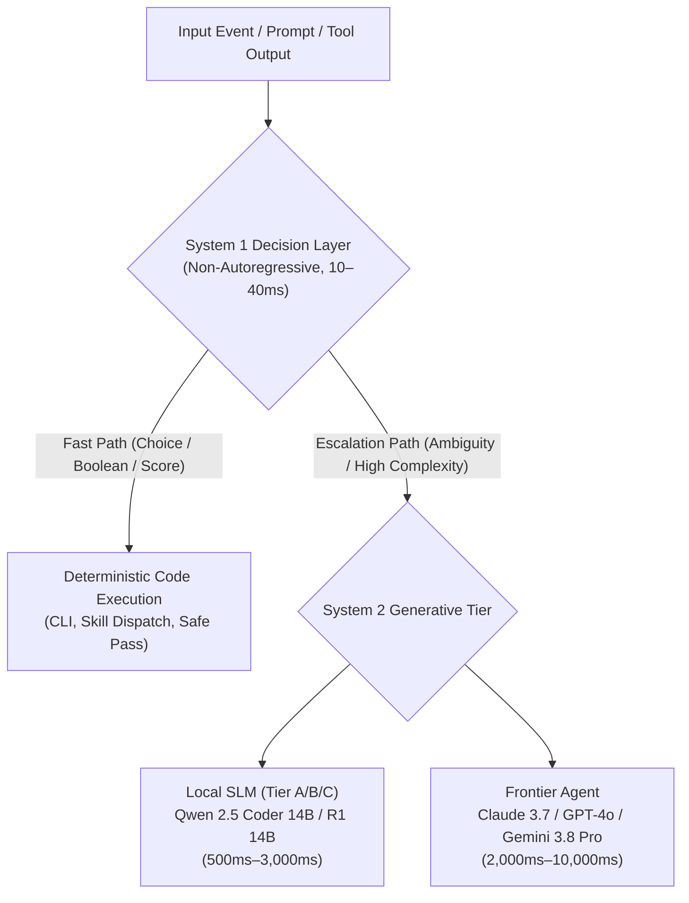

# System One Decision Models: Fast Non-Autoregressive Routing, Triage, and Programmatic Decision Engines

Empirical research into dual-process cognitive architectures, non-autoregressive decision models, and open-source equivalents to proprietary System 1 engines (e.g. TypeSafe AI's Jev) for local agent routing, classification, guardrails, and programmatic branching.

---

## 1. Executive Summary & Dual-Process AI Architecture

Large Language Models (LLMs) in contemporary agent architectures are almost exclusively **System 2** cognitive engines: autoregressive, generative, deliberate, and high-latency. While indispensable for complex refactoring, multi-step planning, and semantic synthesis, employing a multi-billion-parameter System 2 model for simple routing, boolean classification, or safety gating introduces massive latency bottlenecks (1,500ms–5,000ms), high inference costs, and stochastic formatting risks.



### Dual-Process Mapping (Kahneman Dual-Process Theory)

| Dimension | System 1 (Decision Models) | System 2 (Generative LLMs) |
| :--- | :--- | :--- |
| **Cognitive Analogy** | Fast, reflexive, intuitive, subconscious | Slow, effortful, analytical, deliberative |
| **Architecture** | Non-autoregressive (single forward pass) or constrained 1-token head | Autoregressive (token-by-token decoding) |
| **Latency** | **10 ms – 50 ms** (sub-millisecond on tensor batches) | **1,500 ms – 15,000 ms** |
| **Output Type** | Typed schemas, discrete enums, calibrated probabilities, scalar scores | Natural language prose, markdown, code blocks |
| **Failure Modes** | Misclassification (quantifiable via confusion matrix) | Hallucination, formatting drift, prompt injection, timeout |
| **Compute Footprint** | 100M–500M parameters (<1 GB VRAM / minimal CPU RAM) | 7B–70B+ parameters (8 GB–80 GB+ VRAM / cluster) |
| **Primary Role** | "Smart if-statements", routing, triage, guardrails, filter gates | Synthesizing code, executing multi-turn plans, deep reasoning |

---

## 2. Proprietary Benchmark: TypeSafe AI's Jev

In September 2026, TypeSafe AI introduced **Jev**, pioneering commercial "System One" decision models. Jev discarded autoregressive text generation in favor of a typed, non-autoregressive decision interface designed as a drop-in "smart if-statement" for software engineering pipelines:

### 2.1 Jev Interface Contract (`POST /v1/systemone`)

Instead of conversational prompt-completion pairs, Jev takes an input `state` and a dictionary of typed `questions`:

```json
{
  "state": "User requested: 'Refactor test_auth.py to use pytest fixtures and remove mock patch decorators.'",
  "questions": {
    "target_skill": {
      "type": "choice",
      "instructions": "Select the most appropriate skill catalog entry.",
      "criteria": {
        "refactor": "Refactoring existing code for readability or idioms",
        "testing": "Writing new unit or integration test suites",
        "security": "Auditing security vulnerabilities or credentials"
      }
    },
    "is_mutating": {
      "type": "noul",
      "instructions": "Does this request require modifying existing files on disk?"
    },
    "complexity_score": {
      "type": "score",
      "instructions": "Rate the structural complexity on a 1-5 scale."
    }
  }
}
```

### 2.2 Key Operational Primitives
1. **`choice`**: Selects exactly one discrete option from a key-value criteria map, outputting the chosen key and a normalized probability distribution across candidates.
2. **`noul`** (No/Yes/Uncertain): Evaluates a boolean hypothesis, returning calibrated probabilities: $P(\text{yes})$, $P(\text{no})$, and $P(\text{uncertain})$.
3. **`score`**: Evaluates an input against an ordered rubric, returning an expected scalar score and variance.

While Jev established the category, its closed-source, cloud-hosted proprietary API conflicts with offline workstation execution, air-gapped security, zero-cost scaling, and strict privacy requirements.

---

## 3. Open-Source & Open-Weight System 1 Ecosystem

Several open-source and open-weight models deliver identical or superior System 1 capabilities locally:

### 3.1 Laya (Convai Innovations)
- **License:** Apache 2.0 (Open-Weights & Source).
- **Backbone Architecture:** ModernBERT-large (421M parameters).
- **Design Philosophy:** Engineered as a direct, self-hostable, open-source alternative to Jev.
- **Inference Profile:** ~33ms on Nvidia T4; **12–18ms** on modern workstation GPUs; **35–50ms** on CPU via ONNX Runtime (`receptron/laya`).
- **Compatibility:** Features `laya-serve`, exposing a drop-in replacement API for Jev's `POST /v1/systemone`.
- **Python Integration:**
  ```python
  from laya import Router

  router = Router()
  result = router.predict(state="git push --force origin main", questions={
      "is_destructive": {
          "type": "noul",
          "instructions": "Is this git command destructive or rewriting public history?"
      }
  })
  # result['is_destructive'] -> {'answer': 'yes', 'confidence': 0.994}
  ```

### 3.2 ModernBERT (Answer.AI / LightOn)
- **Model Sizes:** `ModernBERT-base` (149M params), `ModernBERT-large` (395M params).
- **Innovations:** Native 8,192 token context window, Rotary Positional Embeddings (RoPE), unpadding via FlashAttention-2, GeGLU activations.
- **Role:** The standard encoder backbone for classification heads, cross-encoders, and bidirectional sequence scoring.
- **Throughput:** Capable of processing over 1,000 classification decisions per second on a single GPU.

### 3.3 Clef & Clef-flash (Cloudflare)
- **Architecture:** Non-autoregressive prefill-only scoring model.
- **Mechanism:** Extracts classification and routing logits directly from intermediate transformer representations without running an autoregressive decoding loop.
- **Target Use Case:** In-line agentic guardrails, prompt-injection defense, and rapid edge dispatch.

### 3.4 Grammar-Constrained Small Language Models (SLMs)
For setups relying entirely on standard Ollama or llama.cpp runtimes without deploying specialized encoder servers:
- **Models:** `SmolLM2-360M-Instruct`, `Qwen2.5-0.5B-Instruct`, `Llama-3.2-1B-Instruct`.
- **Technique:** Grammar-constrained decoding (via llama.cpp BNF grammar, Outlines regex/JSON schema, or Ollama `format`).
- **Optimization:** By constraining the output schema to a single token enum (e.g., `root_skill ::= "refactor" | "test" | "research"`), the generation loop terminates after exactly 1 token ($T=1$), slashing latency from 2,000ms down to **30–60ms**.

---

## 4. System 1 Model Evaluation Matrix

| Model / Architecture | Parameter Count | Weight Footprint (FP16 / Int8) | Typical Latency (GPU) | Typical Latency (CPU) | Context Window | Best Use Case |
| :--- | :--- | :--- | :--- | :--- | :--- | :--- |
| **Laya (ModernBERT-large)** | 421M | 842 MB / 421 MB | **12–20 ms** | 35–50 ms | 8,192 tokens | Native Jev drop-in, multi-attribute schema decisions, calibrated probabilities |
| **ModernBERT-base Classifier** | 149M | 298 MB / 149 MB | **6–10 ms** | 18–25 ms | 8,192 tokens | High-throughput skill classification, security taint analysis |
| **Clef-flash** | ~250M | 500 MB / 250 MB | **10–15 ms** | 30–45 ms | 4,096 tokens | Agentic safety gating, prompt injection classification |
| **Qwen2.5-0.5B-Instruct (FSM-Constrained)** | 490M | 980 MB / 350 MB (Q4) | **35–55 ms** | 70–95 ms | 32,768 tokens | Long-context semantic routing where Ollama/llama.cpp is the sole engine |
| **SmolLM2-360M-Instruct (FSM-Constrained)** | 360M | 720 MB / 250 MB (Q4) | **25–40 ms** | 50–70 ms | 8,192 tokens | Ultra-low footprint CPU classification and mobile/edge agents |
| **BGE-Reranker-v2-m3** | 560M | 1.1 GB / 560 MB | **20–35 ms** | 60–90 ms | 8,192 tokens | Cross-encoder relevance scoring for RAG chunk pre-filtering |

---

## 5. High-Impact Applications in the Harness & Agent Fleet

Deploying System 1 decision models locally yields immediate performance and reliability gains across five core control-plane domains:

### 5.1 Sub-50ms Agent Routing & Skill Dispatch
- **Current Pattern:** Parent agent reads routing tables, matches skills via heuristic keywords or prompts a frontier model (costing tokens and 2–4 seconds of latency).
- **System 1 Pattern:** The incoming user prompt is processed in a single 15ms forward pass by Laya/ModernBERT, mapping directly to candidate skills (`choice` question) with an associated confidence score.
- **Fallback Rule:** If top candidate confidence $< 0.80$, escalate to heuristic Ambiguity Gate or parent frontier reasoning.

### 5.2 Deterministic Mutation & Isolation Gating
- **Problem:** Agents must create isolated worktrees before mutating code. Hallucinated or ambiguous determinations risk editing `main` directly or spawning unnecessary worktrees for read-only queries.
- **System 1 Pattern:** Execute a `noul` decision on whether the prompt requires file mutations (`is_mutating: true/false`). If `true`, the harness CLI automatically provisions an isolated worktree before invoking child agents.

### 5.3 Inline Security Guardrails & Untrusted Tool Scrubbing
- **Risk:** Tool outputs, third-party URLs, or git commits may contain prompt injections or secret leaks.
- **System 1 Pattern:** An inline classifier inspects raw tool output before re-injection into the agent context:
  - `contains_prompt_injection` (`noul`)
  - `contains_unredacted_secrets` (`noul`)
  - Execution time: ~8ms, completely transparent to the user experience.

### 5.4 Deferral Eligibility Filtering (System 1 → System 2 Hand-off)
- **Role:** Deciding *which* model should handle a subtask:
  ```json
  {
    "execution_target": {
      "type": "choice",
      "instructions": "Determine the optimal execution tier for this coding task.",
      "criteria": {
        "deterministic_script": "Mechanical file formatting, linting, or git status check",
        "local_slm_14b": "Standard unit test generation, docstring writing, or boilerplate refactor",
        "frontier_system2": "Architectural refactoring, security analysis, or cross-repo dependency resolution"
      }
    }
  }
  ```

### 5.5 RAG Relevance Cross-Encoder Scoring
- **Pattern:** After BM25 retrieval returns candidate markdown chunks, a System 1 cross-encoder evaluates the exact semantic fit of each chunk against the query, discarding low-relevance noise before context loading.

---

## 6. Implementation & Operational Recommendations

1. **Adopt Laya as the Primary Open-Source System 1 Architecture**:
   - Standardize on `convaiinnovations/laya` (ModernBERT-large 421M) for rich multi-question schemas and calibrated probabilities.
   - Utilize `receptron/laya` (ONNX Runtime) for zero-dependency CPU inference on resource-constrained environments.
2. **Support FSM-Constrained SLMs via Ollama**:
   - For hosts where installing PyTorch or ONNX is deferred, provide Ollama-based 1-token grammar-constrained fallbacks (`qwen2.5:0.5b` or `smollm2:360m`).
3. **Hardware Profile Integration (Tier 0)**:
   - System 1 models require $< 1\text{ GB}$ of VRAM or $< 800\text{ MB}$ of system RAM. They can run concurrently alongside standard desktop apps or Tier A/B generative models without memory contention.
4. **Human Approval Gate**:
   - Consistent with repository security standards, downloading System 1 model weights (e.g. via `local-ai onboard`) remains strictly optional and requires explicit `--approve`.
